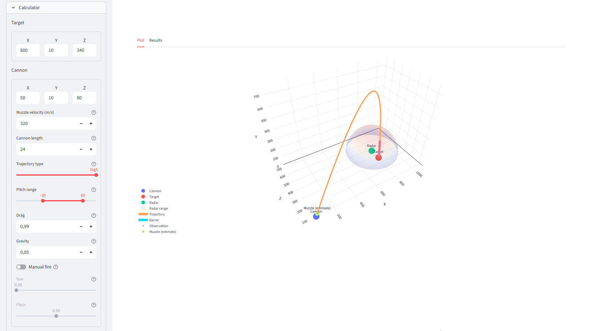
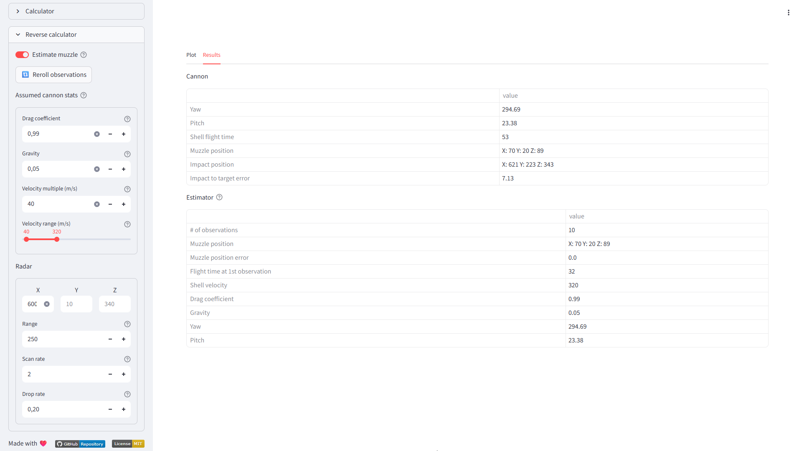
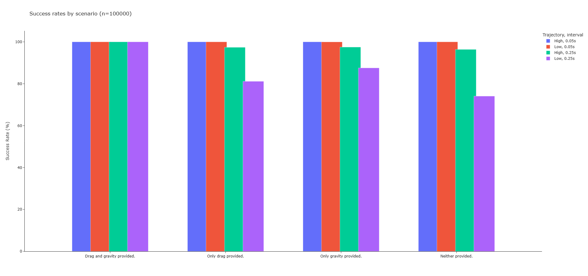

# Create: Big Cannons Cannon Doxxer

A ballistics simulation tool for the [Create: Big Cannons](https://modrinth.com/mod/create-big-cannons) addon.

Features:
- Trajectory visualisation
- Firing solution calculator (with target lead)
- Reverse-locating a cannon's position

Check it out at: https://tornc.github.io/mc_ballistics/.

## How to use

1. Click on the link.
2. Use the sidebar to set simulation parameters. 
3. The 'Calculator' section can fire at coordinates or a moving target.
4. The 'Reverse calculator' has settings that affect the calculator's performance.
5. The main view ('Plot' tab) displays an interactive 3D plot, in which you can move around with the camera.
6. The 'Results' tab shows information required for firing solutions.

---



<p align="center">
    <em>
        Cannon stats and manual firing option (left) and interactive plot (right).
    </em>
</p>



<p align="center">
    <em>
        Enemy cannon muzzle locator (left) and firing solution information (right).
    </em>
</p>

## Muzzle estimator

> [!TIP]
> 1. Inputting drag and gravity values will guarantee 100% success rate, and allows you to only need 2 observations.
> 2. Set the minimum, maximum velocity bounds and velocity multiple. It will reduce computation cost by a bunch.



<p align="center">
    <em>
        With the radar having a 20% drop rate, but I rerolled the observations if there were less than 3. As you can see, providing drag and gravity values is important. You can compensate for that with a low interval, but it's still not 100% guaranteed. (&lt0.025% fail chance). Low trajectories are harder because there's less information to be gotten, especially if your samples are at the top of the trajectory.
    </em>
</p>

Through the drag coefficient (C<sub>d</sub>) and gravity (G), we know the shape of the trajectory (arc). Then, all we need to know is _how far along_ the arc the muzzle is located. We accomplish this by simulating the projectile in reverse step by step (bruteforce), starting from our first observation. To know when to stop, we simulate an arc of the same shape forwards at every step and see if this arc lines up exactly with our observations.


<p align="center">
    <em>
        Visualisation on how it works, drawn by yours truly. Sorry, I'm not an artist 💀.
    </em>
</p>

> [!NOTE]
> We don't forward simulate the entire arc, only parts that correspond to an observation - and only if the velocity is plausible.

## Why?

> Plotly figures are pretty and WebApps are cool.

I guess I got sidetracked 😅.

Anyways, the initial goal was to make a proof of concept that demonstrated the possibility of automated counter-battery systems. This is done through a Some Peripherals' Radar or anything equivalent. The key requirement is that the peripheral has to **detect entities and record their positions**.

## Build instructions

1. Download the repository.

```bash
git clone https://github.com/Tornc/mc_ballistics.git
```

2. Install the requirements.

```bash
pip install -r requirements.txt
```

3. Run the app.

```bash
streamlit run app.py
```

Or run `script.cmd` (it does the exact same thing as `streamlit run app.py`).

4. The app will open in your browser.

## Credits

**@sashafiesta**: Formulas for trajectory simulation. See the pinned message in the showcase channel of the [CBC discord](https://discord.gg/vgfMMUUgvT).

**@malexy**: Major inspiration was taken from [brute-force pitch calculator](https://github.com/Malex21/CreateBigCannons-BallisticCalculator) while I was still figuring things out.

**@endal**: The pitch calculator is based entirely on their [Desmos calculator](https://www.desmos.com/calculator/az4angyumw). It's very fast and laser-accurate.

If you're interested in CBC ballistics, I highly recommend taking a look at their works.

## TODO

- [ ] Link the specific Discord message from @sashafiesta.
- [ ] Commenting in simulation.py for estimating cd and g.
- [ ] Make target lead function not inefficient as fuck.
- [ ] Create a proper binary without: 1) Pyodide / package load times. 2) fugly Electron bar.
