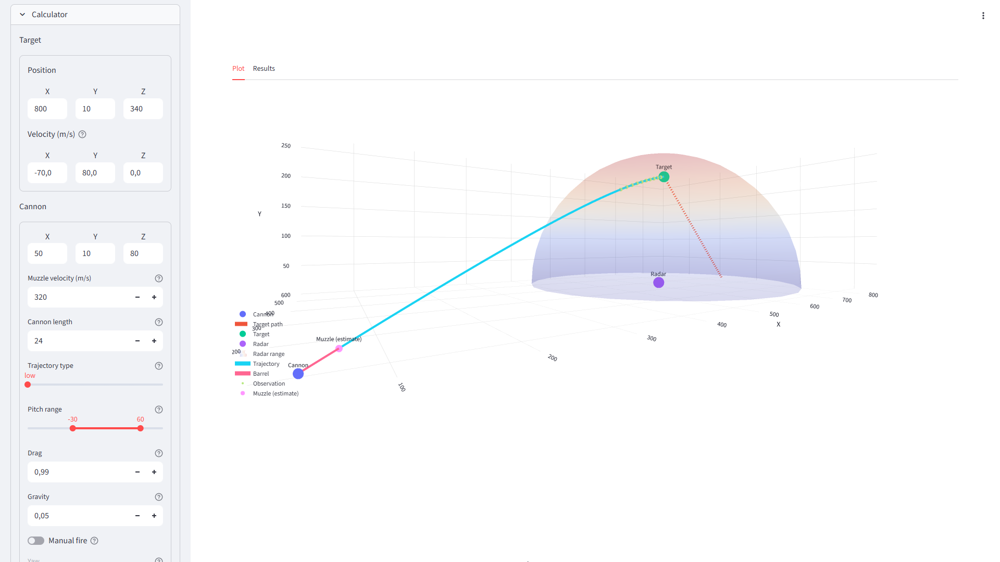

# Create: Big Cannons Cannon Doxxer

A ballistics simulation tool for the [Create: Big Cannons](https://modrinth.com/mod/create-big-cannons) addon. Features trajectory visualisation, a firing solution calculator and a way to reverse-locate a cannon's position... in theory.

Check it out at: https://tornc.github.io/mc_ballistics/.

---



<p align="center">
    <em>
        Cannon stats and manual firing option (left) and interactive plot (right).
    </em>
</p>


<p align="center">
    <em>
        Enemy cannon muzzle locator (left) and firing solution information (right).
    </em>
</p>

## How to use

1. Click on the link.
2. Use the sidebar to set simulation parameters. The 'Calculator' section contains run-of-the-mill features for firing at coordinates. The 'Reverse calculator' is the one doing the 'doxxing'.
3. The main view ('Plot' tab) displays an interactive 3D plot, in which you can move around with the camera.
4. The 'Results' tab shows information required for firing solutions.

## Why?

> Plotly figures are pretty and WebApps are cool.

I guess I got sidetracked 😅.

Anyways, the initial goal was to make a proof of concept that demonstrated the possibility of automated counter-battery systems. This is done through a Some Peripherals' Radar or anything equivalent. The key requirement is that the peripheral has to **detect entities and record their positions**.

## How the estimator works

For now, it's left as an exercise to the reader. 💀

## Installation

1. Download the repository.

```
$ git clone https://github.com/Tornc/mc_ballistics.git
```

2. Install the requirements.

```
$ pip install -r requirements.txt
```

3. Run the app.

```cmd
streamlit run app.py
```

Or run `script.cmd` (it does the exact same thing as `streamlit run app.py`).

4. The app will open in your browser.

## Credits

**@sashafiesta**: Formulas for trajectory simulation. See the pinned message in the showcase channel of the [CBC discord](https://discord.gg/vgfMMUUgvT).

**@malexy**: Major inspiration was taken from [brute-force pitch calculator](https://github.com/Malex21/CreateBigCannons-BallisticCalculator) while I was still figuring things out.

**@endal**: My own pitch calculator is based entirely on their [Desmos calculator](https://www.desmos.com/calculator/az4angyumw). It's very fast and laser-accurate.

If you're interested in CBC ballistics, I highly recommend taking a look at their works.

## TODO

- [ ] Closed form solver instead of brute force simulation!!!!!
- [ ] It'd be nice to explain how the muzzle locator function works conceptually with illustrations.
- [ ] Link the specific Discord message.
- [ ] Create a proper binary without: 1) Pyodide / package load times. 2) fugly Electron bar
